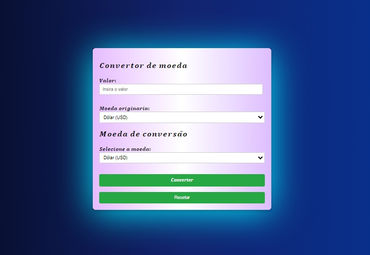

# License
> 

## 𝑪𝒐𝒏𝒗𝒆𝒓𝒔𝒐𝒓 𝒅𝒆 𝒎𝒐𝒆𝒅𝒂𝒔
 
## Descrição do Projeto
Este projeto foi desenvolvido na aula de PWI (Programação Web 1), ministrada pelo professor [Leonardo Rocha](https://github.com/leonardossrocha). O objetivo do projeto é aprender a converter valores de moedas, ainda de forma simples, porém logo esse projeto terá uma continuação mais aprimorada juntamente com o consumo de API.
 
 ## TELA DO PROJETO
 

 ## Projeto funcionando
 
 
## Funcionalidades do website
 
✔️ Verificação de Campos Obrigatórios;
 
✔️ Resetar o formulário;
 
✔️ Preencher Formulário;
 
✔️ Converter moeda;
 
✔️ Inserir valor;
 
✔️ Resultado do valor inserido;
 
✔️ Definir Taxas de câmbio;

✔️ Definir taxas de câmbio manualmente
 
 
# Funcionalidades JS utilizadas🔧
1- Recuperação de valores de entrada: Recupera os valores inseridos pelo usuário nos campos do formulário
 
2- Definição de taxas de câmbio: Define um objeto de taxas de câmbio fixas exchangeRates que contém as taxas de conversão entre diferentes moedas (USD, BRL e EUR).
 
3- Conversão de moeda: converte a moeda, deMoeda, paraMoeda.
 
4- Exibição do resultado: Atualiza o conteúdo de texto do elemento com o id "result" para exibir o valor convertido, arredondado para duas casas decimais usando toFixed(2), juntamente com o símbolo da moeda convertida.
 
# Inserir valor de taxa de câmbio
~~~ Javascript
document.getElementById ('currency-converter').addEventListener('submit', function(event){
    event.preventDefault();
 
    // Obter valores de entrada informados pelo usuário
    const valor = parseFloat(document.getElementById('amount').value);
    const daMoeda = document.getElementById('daMoeda').value;
    const paraMoeda = document.getElementById('paraMoeda').value;
~~~
 
# Definição de taxas de câmbio
~~~ Javascript
const exchangeRates = {
        USD: { BRL: 5.70, EUR: 0.93 },
        BRL: { USD: 0.18, EUR: 0.16 },
        EUR: { USD: 1.08, EUR: 6.16 }
 
    };
~~~
 
~~~ Javascript
// Conversão simples de moeda
    let valorConvertido;
    if(daMoeda === paraMoeda){
        valorConvertido = valor;
    }else{
        valorConvertido = valor * exchangeRates[daMoeda][paraMoeda];
    } 
~~~

## COMO USAR
1. Selecione a moeda de origem e destino BRL, EUR, USD E EUR.
2. Insira o valor que deseja converter e tera o valor convertido.

 
 
 
## Tecnlogias utilizadas 🔧

### Colaboradores
- [Etore Bryan Digeras](https://github.com/BrayanCorreians): Desenvolvedor;
- [Eduardo Costa](https://github.com/eduardoocosta): Desenvolvedor;
